# Project Leo — TypingHub & Composition Studio

A full-featured web application combining competitive speed typing, real-time multiplayer racing, and a DAW-lite MIDI piano composition studio. Built with React 19, Zustand, Socket.io, and the Web Audio/MIDI APIs.

---

## Table of Contents

1. [Tech Stack](#tech-stack)
2. [What's Actually Built](#whats-actually-built)
3. [Project Structure](#project-structure)
4. [Architecture Overview](#architecture-overview)
5. [State Management](#state-management)
6. [Routing & Page Flow](#routing--page-flow)
7. [Feature Modules](#feature-modules)
   - [Typing Mode](#typing-mode)
   - [Race Mode](#race-mode)
   - [Piano / Composition Studio](#piano--composition-studio)
   - [Educator Dashboard](#educator-dashboard)
   - [Stats](#stats)
   - [Authentication](#authentication)
   - [Settings & Themes](#settings--themes)
8. [Backend & Persistence](#backend--persistence)
9. [Data Flows](#data-flows)
10. [Component Hierarchy](#component-hierarchy)
11. [Design System](#design-system)
12. [External Integrations](#external-integrations)
13. [Testing & CI](#testing--ci)
14. [Getting Started](#getting-started)

---

## Tech Stack

| Layer | Technology | Version |
|-------|-----------|---------|
| UI Framework | React | 19.2.6 |
| Bundler | Vite | 8.0.12 |
| State Management | Zustand | 5.0.13 |
| Real-time | Socket.io (client + server) | 4.8.3 |
| MIDI Parsing | @tonejs/midi | 2.0.28 |
| Analytics Charts | Chart.js + react-chartjs-2 | 4.5.1 |
| Icons | Lucide React | 1.17.0 |
| Audio Analysis | @spotify/basic-pitch | (optional install) |
| Backend | Express | 5.2.1 |
| Auth | jsonwebtoken + bcryptjs | 9.0.3 / 3.0.3 |
| Validation | Zod | 4.4.3 |
| Persistence | JSON file (default) or PostgreSQL (`pg`, opt-in via `DATABASE_URL`) | 8.23.0 |
| Testing | Vitest + Testing Library + Supertest | 4.1.11 |

---

## What's Actually Built

Every product surface below is real, working UI backed by a real server —
not a mock. **Guest mode works everywhere with zero setup** (guests race
and play piano exactly like signed-in users; only progress persistence —
stats history, MMR/wallet, teacher rosters — needs an account). Full detail
and what's still a stub lives in [`ROADMAP.md`](ROADMAP.md); this is the
short version:

- **Typing Hub** — practice modes, funboxes, 8 language/code word pools,
  live WPM, post-run accuracy breakdown with a consistency score.
- **Race Mode** — real Socket.io matchmaking, text voting, a countdown that
  withholds the passage until it ends (anti-cheat), MMR/coin payouts —
  falls back to local bots if no players queue or the server's down.
- **Piano / Composition Studio** — full-width falling-notes stage with
  note-letter hints, four switchable instrument voices (a real sampled
  Grand Piano plus three synthesized), a sticky quick-access bar (transport,
  instrument picker, circular Metronome/Chord Selector popovers), Teaching
  Mode (step-by-step, waits for the right key), microphone pitch detection
  for real acoustic instruments, a Community Library of built-in
  public-domain tracks plus real MIDI upload/export, and a separate
  ambient "Canvas" visualizer mode.
- **Educator Dashboard** — a real per-teacher roster (join code + each
  student's aggregate WPM/accuracy/last-active), real bulk student account
  creation, CSV export. The Focus tab (mode-lock broadcast) is the one
  piece still a client-only stub — no server-side session enforcement yet.
- **Stats** — server-persisted run history, a WPM trend chart, and
  summary tiles, gated behind sign-in (guests still race/type/play piano
  fully; nothing about *using* the app requires an account, only
  *remembering* it does).
- **Auth** — real JWT access tokens + rotating refresh tokens with reuse
  detection, bcrypt hashing, rate limiting.
- **Persistence** — a JSON file by default (zero config); PostgreSQL is a
  drop-in opt-in swap (`DATABASE_URL`) with the exact same interface, a
  Compose-profile-gated `postgres` service, and a migration script for
  cutting existing data over deliberately.
- **Tests + CI** — Vitest across frontend and server (auth, race lobby
  lifecycle, stats, teacher roster, persistence-layer parity), GitHub
  Actions running lint/build/test on every push and PR.

---

## Screenshots

<table>
<tr>
<td width="50%">

**Typing Hub**
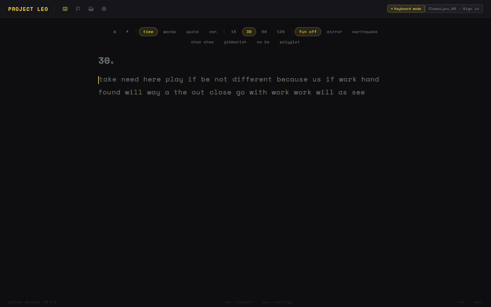

</td>
<td width="50%">

**Typing in progress**
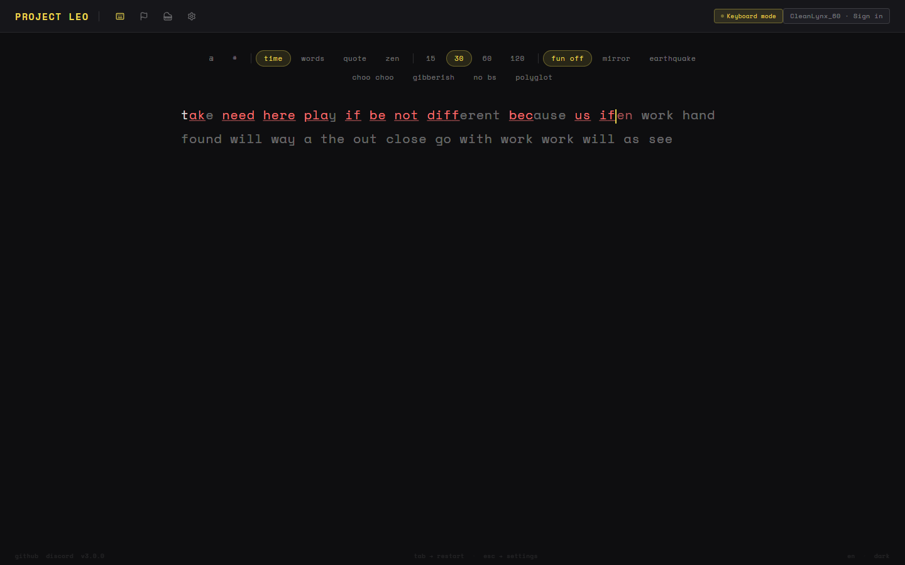

</td>
</tr>
<tr>
<td width="50%">

**Race Mode — live multiplayer**
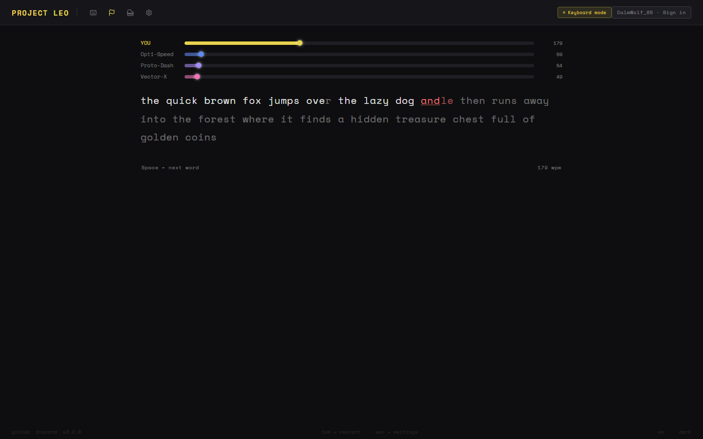

</td>
<td width="50%">

**Piano Studio — falling notes**
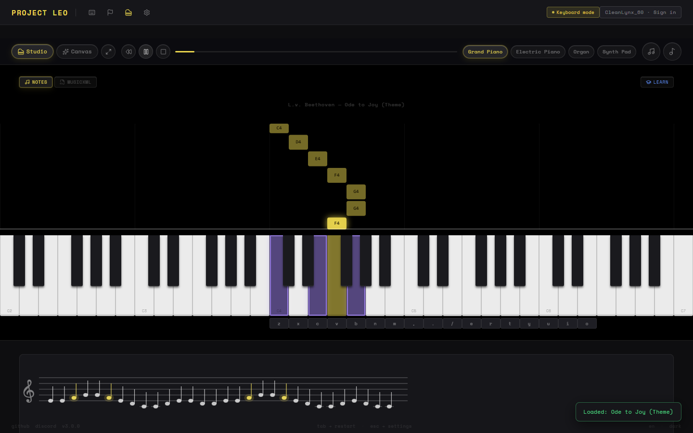

</td>
</tr>
<tr>
<td width="50%">

**Piano Studio — Chord Selector**
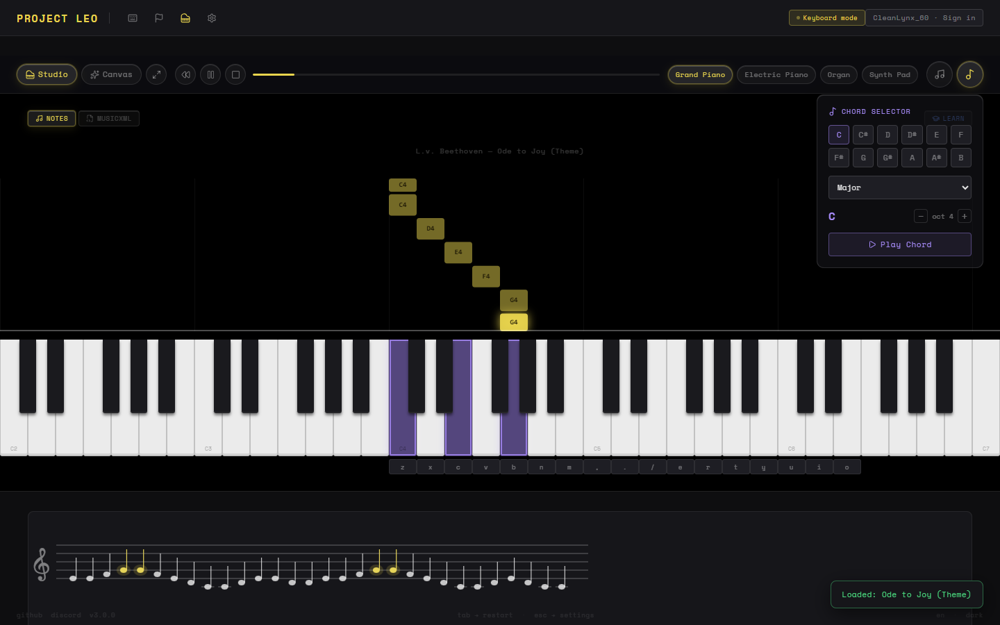

</td>
<td width="50%">

**Educator Dashboard — Roster**
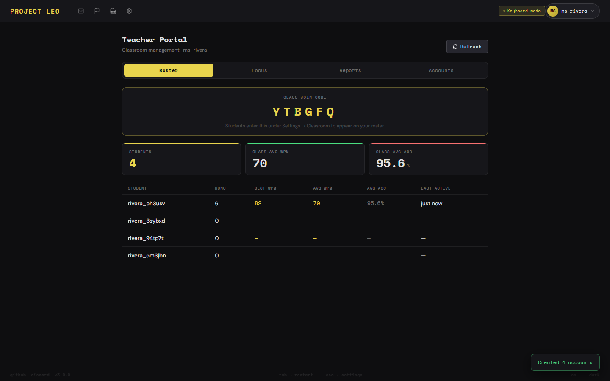

</td>
</tr>
<tr>
<td width="50%">

**Stats — run history & trend**
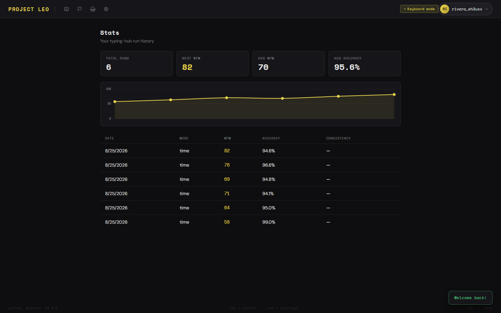

</td>
<td width="50%"></td>
</tr>
</table>

---

## Project Structure

```
leo-app/
├── public/
│   ├── audio/salamander/            # Real Grand Piano samples (CC BY 3.0)
│   └── community-midi/              # User-supplied .mid files (gitignored)
├── src/
│   ├── main.jsx                     # Entry point
│   ├── App.jsx                      # Root layout + routing
│   ├── App.css
│   ├── index.css                    # Design tokens, themes, global styles
│   │
│   ├── store/
│   │   ├── index.js                 # All Zustand stores + word pools
│   │   └── index.test.js
│   │
│   ├── lib/
│   │   ├── instruments/             # Instrument registry — grand piano
│   │   │                            #   (sampled + additive-synth fallback),
│   │   │                            #   electric piano, organ, synth pad
│   │   ├── audioContext.js          # Shared AudioContext singleton
│   │   ├── chords.js                # Chord Selector's interval tables
│   │   ├── communityMidiManifest.js # "Your Library" track list
│   │   ├── computeConsistency.js    # Typing-run consistency score
│   │   ├── glowCircle.js            # Shared ambient-light particle effect
│   │   ├── keySound.js              # Web Audio key-click sounds
│   │   └── pianoLayout.js           # Shared key-position geometry
│   │
│   ├── hooks/
│   │   ├── useTypingEngine.js       # Typing state machine
│   │   ├── useMidi.js               # Web MIDI API + keyboard fallback
│   │   ├── useSocket.js             # Socket.io race event bindings
│   │   ├── useCompositionPlayback.js# Piano transport engine (play/seek/rewind)
│   │   ├── useTeachingMode.js       # Step-by-step "wait for the right key"
│   │   └── useMicPitch.js           # YIN pitch detection from the mic
│   │
│   ├── pages/
│   │   └── AuthPages.jsx            # Login + Register pages
│   │
│   └── components/
│       ├── nav/
│       │   ├── TopNav.jsx           # Navigation bar + profile dropdown
│       │   └── MidiIndicator.jsx    # MIDI hardware status chip
│       │
│       ├── typing/
│       │   ├── TypingCanvas.jsx     # 3-line typing viewport + caret
│       │   ├── ModeToolbar.jsx      # Mode/time/funbox pill toggles
│       │   └── Footer.jsx           # Timer + status bar
│       │
│       ├── results/
│       │   └── ResultsScreen.jsx    # WPM/accuracy + Chart.js graph
│       │
│       ├── race/
│       │   └── RacePage.jsx         # Multiplayer race UI + progress bars
│       │
│       ├── stats/
│       │   └── StatsPage.jsx        # Server-persisted run history + trend
│       │
│       ├── piano/
│       │   ├── PianoMode.jsx        # Composition studio main panel
│       │   ├── PianoQuickBar.jsx    # Sticky transport/instrument/circles bar
│       │   ├── FallingNotes.jsx     # Synthesia-style falling-note canvas
│       │   ├── ChordSelector.jsx    # Root+quality chord picker
│       │   ├── Metronome.jsx        # BPM/time-sig click track
│       │   ├── PianoKeys.jsx        # Virtual, fluid-width keyboard
│       │   ├── PianoKeymap.jsx      # Computer-key label strip
│       │   ├── DotPianoCanvas.jsx   # Ambient per-note light layer
│       │   ├── PianoCanvasMode.jsx  # Full-ambient "ombre lights" mode
│       │   ├── SheetMusic.jsx       # SVG treble-clef staff renderer
│       │   └── MusicXMLViewer.jsx   # MusicXML file loader + viewer
│       │
│       ├── settings/
│       │   ├── SettingsPage.jsx     # Theme/font/language/sound + Classroom join
│       │   └── CLIOverlay.jsx       # Command palette (Escape key)
│       │
│       ├── educator/
│       │   └── EducatorDashboard.jsx # Roster, Focus, Reports, Accounts tabs
│       │
│       └── ui/
│           └── Toast.jsx            # Toast notification system
│
├── server/                          # Express + Socket.io backend — see
│   │                                #   "Backend & Persistence" below
│   ├── index.js                     # Entrypoint (node server/index.js)
│   ├── app.js                       # Express app factory
│   ├── lib/                        # db.js (JSON) / pgDb.js (Postgres),
│   │                                #   security.js, validation.js, ...
│   ├── routes/                      # auth, profile, stats, teacher
│   ├── race/                        # Socket.io matchmaking + scoring
│   └── scripts/migrate-json-to-pg.js
│
├── vite.config.js
├── docker-compose.yml
└── package.json
```

---

## Architecture Overview

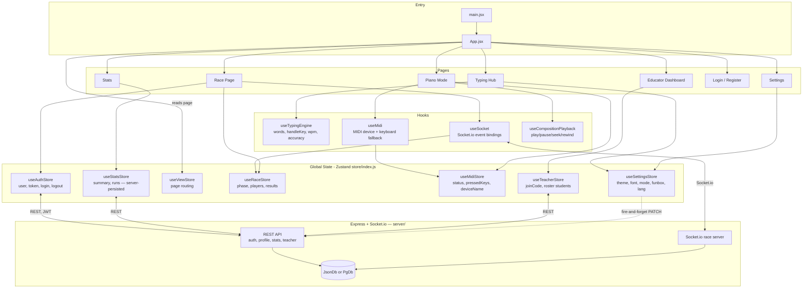
```mermaid
graph TD
    subgraph Entry
        main[main.jsx] --> App[App.jsx]
    end

    subgraph Global State - Zustand store/index.js
        AuthStore[useAuthStore\nuser, token, login, logout]
        SettingsStore[useSettingsStore\ntheme, font, mode, funbox, lang]
        ViewStore[useViewStore\npage routing]
        RaceStore[useRaceStore\nphase, players, results]
        MidiStore[useMidiStore\nstatus, pressedKeys, deviceName]
        StatsStore[useStatsStore\nsummary, runs — server-persisted]
        TeacherStore[useTeacherStore\njoinCode, roster students]
    end

    subgraph Hooks
        TypingEngine[useTypingEngine\nwords, handleKey, wpm, accuracy]
        MidiHook[useMidi\nMIDI device + keyboard fallback]
        SocketHook[useSocket\nSocket.io event bindings]
        Playback[useCompositionPlayback\nplay/pause/seek/rewind]
    end

    subgraph Pages
        TypePage[Typing Hub]
        RacePage[Race Page]
        PianoPage[Piano Mode]
        StatsPage[Stats]
        SettingsPage[Settings]
        AuthPages[Login / Register]
        EducatorPage[Educator Dashboard]
    end

    subgraph Backend[Express + Socket.io — server/]
        API[REST API\nauth, profile, stats, teacher]
        RaceServer[Socket.io race server]
        DB[(JsonDb or PgDb)]
    end

    App -->|reads page| ViewStore
    App --> TypePage
    App --> RacePage
    App --> PianoPage
    App --> StatsPage
    App --> SettingsPage
    App --> AuthPages
    App --> EducatorPage

    TypePage --> TypingEngine
    RacePage --> SocketHook
    SocketHook <-->|Socket.io| RaceServer
    SocketHook --> RaceStore
    PianoPage --> MidiHook
    PianoPage --> Playback
    MidiHook --> MidiStore

    TypePage --> SettingsStore
    RacePage --> AuthStore
    RacePage --> RaceStore
    PianoPage --> MidiStore
    SettingsPage --> SettingsStore
    StatsPage --> StatsStore
    EducatorPage --> TeacherStore

    AuthStore <-->|REST, JWT| API
    StatsStore <-->|REST| API
    TeacherStore <-->|REST| API
    SettingsStore -.->|fire-and-forget PATCH| API
    API --> DB
    RaceServer --> DB
```

---

## State Management

All global state lives in `src/store/index.js` as five Zustand stores. Components subscribe directly — no prop drilling.

### Store Map

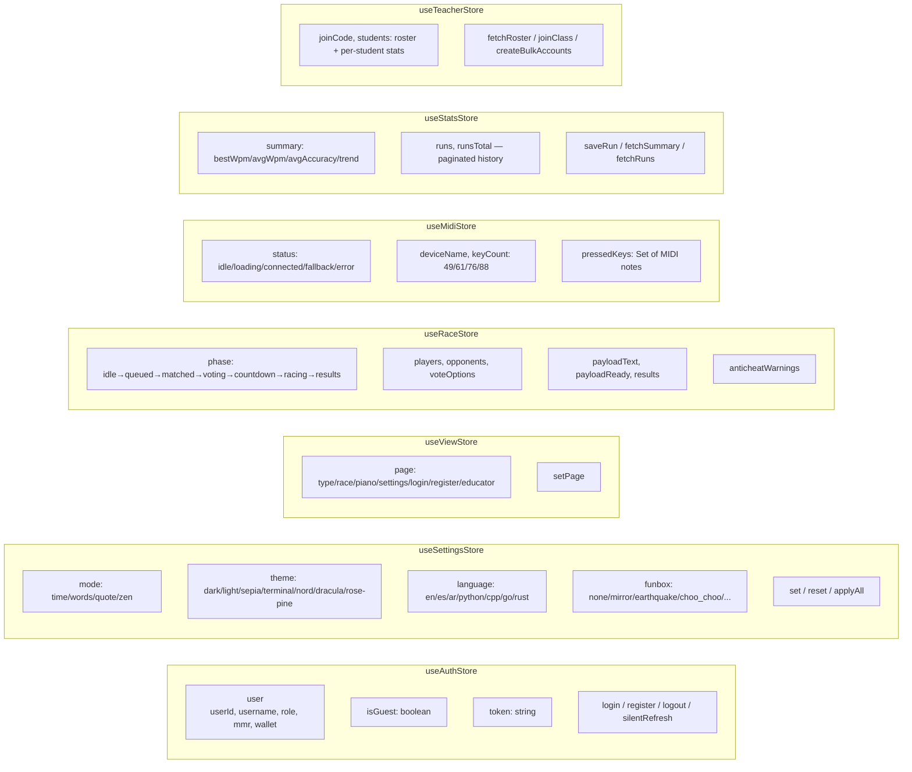
```mermaid
graph LR
    subgraph useAuthStore
        A1[user\nuserId, username, role, mmr, wallet]
        A2[isGuest: boolean]
        A3[token: string]
        A4[login / register / logout / silentRefresh]
    end

    subgraph useSettingsStore
        S1[mode: time/words/quote/zen]
        S2[theme: dark/light/sepia/terminal/nord/dracula/rose-pine]
        S3[language: en/es/ar/python/cpp/go/rust]
        S4[funbox: none/mirror/earthquake/choo_choo/...]
        S5[set / reset / applyAll]
    end

    subgraph useViewStore
        V1[page: type/race/piano/settings/login/register/educator]
        V2[setPage]
    end

    subgraph useRaceStore
        R1[phase: idle→queued→matched→voting→countdown→racing→results]
        R2[players, opponents, voteOptions]
        R3[payloadText, payloadReady, results]
        R4[anticheatWarnings]
    end

    subgraph useMidiStore
        M1[status: idle/loading/connected/fallback/error]
        M2[deviceName, keyCount: 49/61/76/88]
        M3[pressedKeys: Set of MIDI notes]
    end

    subgraph useStatsStore
        ST1[summary: bestWpm/avgWpm/avgAccuracy/trend]
        ST2[runs, runsTotal — paginated history]
        ST3[saveRun / fetchSummary / fetchRuns]
    end

    subgraph useTeacherStore
        TC1[joinCode, students: roster + per-student stats]
        TC2[fetchRoster / joinClass / createBulkAccounts]
    end
```

### Settings Persistence Flow

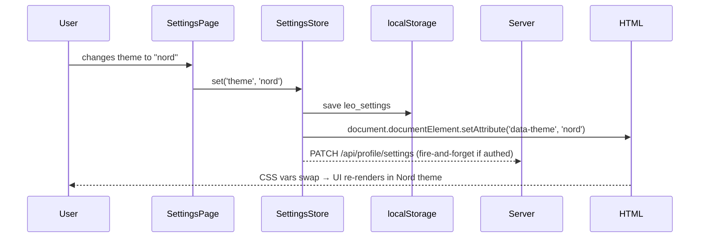
```mermaid
sequenceDiagram
    participant User
    participant SettingsPage
    participant SettingsStore
    participant localStorage
    participant Server
    participant HTML

    User->>SettingsPage: changes theme to "nord"
    SettingsPage->>SettingsStore: set('theme', 'nord')
    SettingsStore->>localStorage: save leo_settings
    SettingsStore->>HTML: document.documentElement.setAttribute('data-theme', 'nord')
    SettingsStore-->>Server: PATCH /api/profile/settings (fire-and-forget if authed)
    HTML-->>User: CSS vars swap → UI re-renders in Nord theme
```

### Auth Token Lifecycle

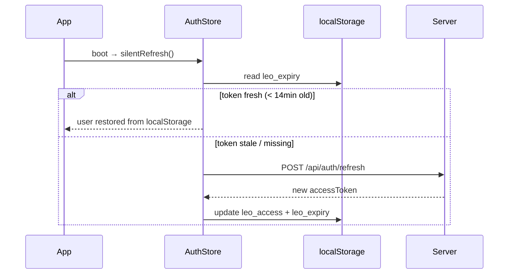
```mermaid
sequenceDiagram
    participant App
    participant AuthStore
    participant localStorage
    participant Server

    App->>AuthStore: boot → silentRefresh()
    AuthStore->>localStorage: read leo_expiry
    alt token fresh (< 14min old)
        AuthStore-->>App: user restored from localStorage
    else token stale / missing
        AuthStore->>Server: POST /api/auth/refresh
        Server-->>AuthStore: new accessToken
        AuthStore->>localStorage: update leo_access + leo_expiry
    end
```

---

## Routing & Page Flow

Routing is a simple `page` string in `useViewStore` — no React Router. `App.jsx` renders the matching component.

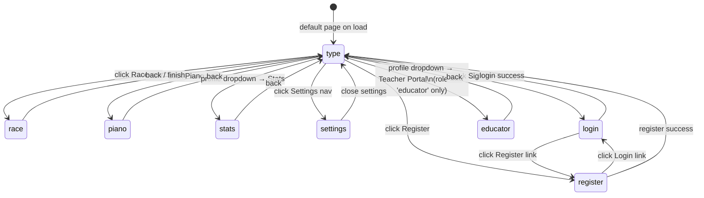
```mermaid
stateDiagram-v2
    [*] --> type : default page on load

    type --> race : click Race nav
    type --> piano : click Piano nav
    type --> stats : profile dropdown → Stats
    type --> settings : click Settings nav
    type --> login : click Sign In
    type --> register : click Register
    type --> educator : profile dropdown → Teacher Portal\n(role === 'educator' only)

    race --> type : back / finish
    piano --> type : back
    stats --> type : back
    settings --> type : close settings
    educator --> type : back

    login --> type : login success
    login --> register : click Register link
    register --> login : click Login link
    register --> type : register success
```

### Auth Guard Policy

Guests get full access to Type, Race, and Piano — *using* any mode never
requires an account; only *remembering* it does. Two pages are gated, for
two different reasons:

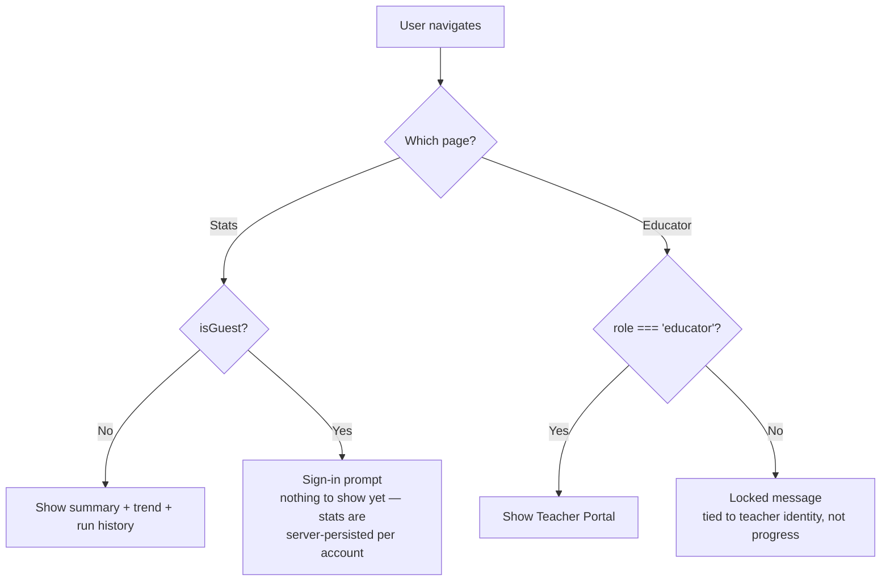
```mermaid
flowchart TD
    NavClick[User navigates] --> Which{Which page?}
    Which -->|Stats| IsGuest{isGuest?}
    IsGuest -->|No| ShowStats[Show summary + trend + run history]
    IsGuest -->|Yes| SignInGate[Sign-in prompt\nnothing to show yet — stats are\nserver-persisted per account]

    Which -->|Educator| IsEducator{role === 'educator'?}
    IsEducator -->|Yes| ShowDash[Show Teacher Portal]
    IsEducator -->|No| LockScreen[Locked message\ntied to teacher identity, not progress]
```

Stats is gated because there's genuinely nothing to show a guest — runs
are only ever persisted for signed-in users (`POST /api/stats/runs`
requires auth). Educator Dashboard is gated because it's tied to *who* the
signed-in teacher is, not to saving progress. Race MMR/wallet and Piano
compositions still work fully for guests; they just don't persist across
sessions, matching the same "use freely, remember only if signed in"
philosophy everywhere else.

---

## Feature Modules

### Typing Mode

The core typing experience. Lives in `src/components/typing/`.

#### Architecture

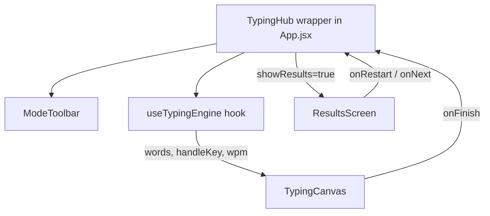
```mermaid
graph TD
    TypingHub[TypingHub wrapper in App.jsx]

    TypingHub --> ModeToolbar
    TypingHub --> Engine[useTypingEngine hook]
    Engine --> |words, handleKey, wpm| TypingCanvas
    TypingCanvas --> |onFinish| TypingHub
    TypingHub --> |showResults=true| ResultsScreen
    ResultsScreen --> |onRestart / onNext| TypingHub
```

#### Typing Engine State Machine

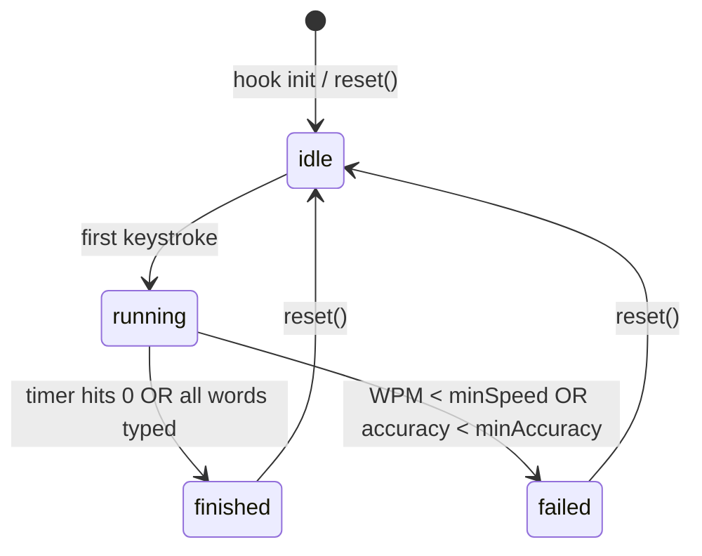
```mermaid
stateDiagram-v2
    [*] --> idle : hook init / reset()
    idle --> running : first keystroke
    running --> finished : timer hits 0 OR all words typed
    running --> failed : WPM < minSpeed OR accuracy < minAccuracy
    finished --> idle : reset()
    failed --> idle : reset()
```

#### Word Generation Pipeline

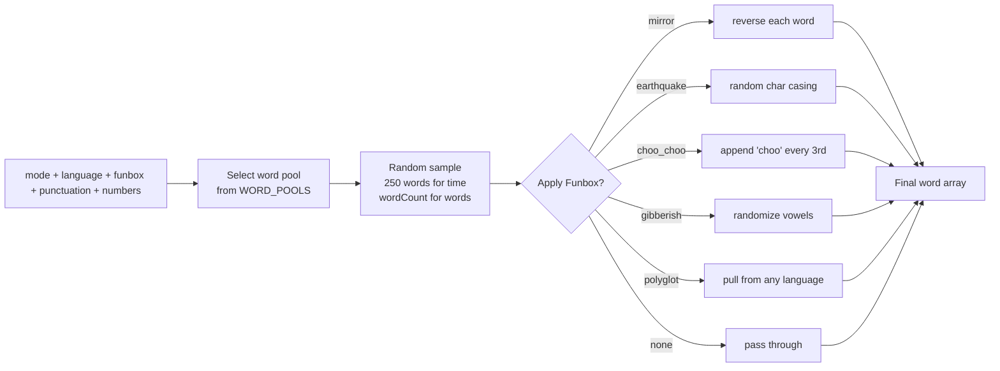
```mermaid
flowchart LR
    Settings[mode + language + funbox + punctuation + numbers]
    --> Pool[Select word pool\nfrom WORD_POOLS]
    --> Sample[Random sample\n250 words for time\nwordCount for words]
    --> Transform{Apply Funbox?}

    Transform -->|mirror| Reverse[reverse each word]
    Transform -->|earthquake| Scramble[random char casing]
    Transform -->|choo_choo| Choo[append 'choo' every 3rd]
    Transform -->|gibberish| Gibber[randomize vowels]
    Transform -->|polyglot| Poly[pull from any language]
    Transform -->|none| Pass[pass through]

    Reverse --> Output[Final word array]
    Scramble --> Output
    Choo --> Output
    Gibber --> Output
    Poly --> Output
    Pass --> Output
```

#### WPM Calculation

```
WPM     = (correctChars / 5) / (durationMs / 60000)
Raw WPM = (totalChars / 5) / (durationMs / 60000)
Accuracy = (correctChars / totalKeystrokes) × 100
```

#### Key Handling Flow

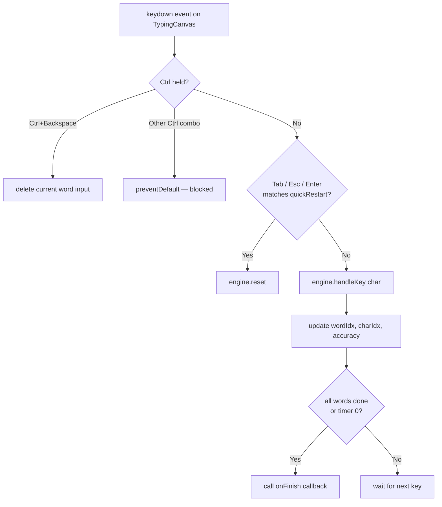
```mermaid
flowchart TD
    Keydown[keydown event on TypingCanvas]
    --> IsCtrl{Ctrl held?}
    IsCtrl -->|Ctrl+Backspace| DeleteWord[delete current word input]
    IsCtrl -->|Other Ctrl combo| Block[preventDefault — blocked]

    IsCtrl -->|No| IsRestart{Tab / Esc / Enter\nmatches quickRestart?}
    IsRestart -->|Yes| Reset[engine.reset]
    IsRestart -->|No| HandleKey[engine.handleKey char]

    HandleKey --> UpdateState[update wordIdx, charIdx, accuracy]
    UpdateState --> CheckFinish{all words done\nor timer 0?}
    CheckFinish -->|Yes| onFinish[call onFinish callback]
    CheckFinish -->|No| Continue[wait for next key]
```

---

### Race Mode

Real-time multiplayer racing via Socket.io. Lives in `src/components/race/RacePage.jsx` and `src/hooks/useSocket.js`.

#### Race Phase Lifecycle

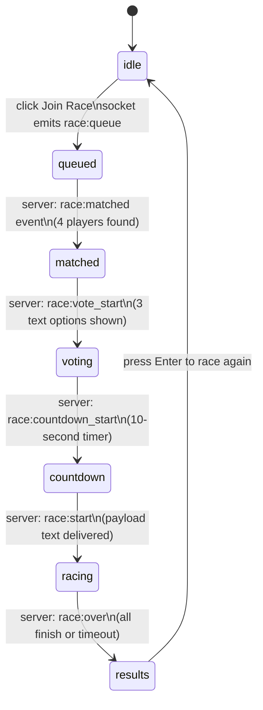
```mermaid
stateDiagram-v2
    [*] --> idle
    idle --> queued : click Join Race\nsocket emits race:queue
    queued --> matched : server: race:matched event\n(4 players found)
    matched --> voting : server: race:vote_start\n(3 text options shown)
    voting --> countdown : server: race:countdown_start\n(10-second timer)
    countdown --> racing : server: race:start\n(payload text delivered)
    racing --> results : server: race:over\n(all finish or timeout)
    results --> idle : press Enter to race again
```

#### Socket Event Flow

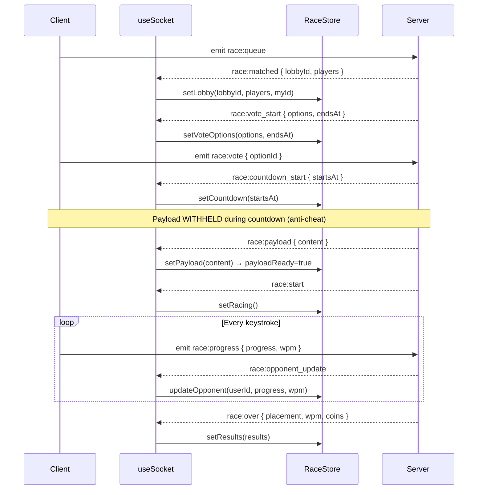
```mermaid
sequenceDiagram
    participant Client
    participant useSocket
    participant RaceStore
    participant Server

    Client->>Server: emit race:queue
    Server-->>useSocket: race:matched { lobbyId, players }
    useSocket->>RaceStore: setLobby(lobbyId, players, myId)

    Server-->>useSocket: race:vote_start { options, endsAt }
    useSocket->>RaceStore: setVoteOptions(options, endsAt)
    Client->>Server: emit race:vote { optionId }

    Server-->>useSocket: race:countdown_start { startsAt }
    useSocket->>RaceStore: setCountdown(startsAt)

    Note over Server,Client: Payload WITHHELD during countdown (anti-cheat)
    Server-->>useSocket: race:payload { content }
    useSocket->>RaceStore: setPayload(content) → payloadReady=true

    Server-->>useSocket: race:start
    useSocket->>RaceStore: setRacing()

    loop Every keystroke
        Client->>Server: emit race:progress { progress, wpm }
        Server-->>useSocket: race:opponent_update
        useSocket->>RaceStore: updateOpponent(userId, progress, wpm)
    end

    Server-->>useSocket: race:over { placement, wpm, coins }
    useSocket->>RaceStore: setResults(results)
```

#### Bot Race Fallback

When no server is available, `RacePage` generates local bots:

| Difficulty | WPM Range | Bot Names (sample) |
|-----------|-----------|---------------------|
| normal | 42–68 WPM | Nitro-V, Turbo-Flux |
| expert | 70–95 WPM | Cyber-Spec, Opti-Speed |
| master | 98–130 WPM | Ultra-Strike, Mega-Volt |

Coin rewards: 1st = 120 coins, 2nd = 60, 3rd = 30, 4th = 10.

---

### Piano / Composition Studio

A DAW-lite music studio with two modes — **Studio** (composition, playback,
teaching) and **Canvas** (ambient light visualizer, no keyboard). Lives in
`src/components/piano/`, with shared layout/audio logic in `src/lib/`.

#### Layout: the sticky quick bar + immersive falling-notes stage

`PianoQuickBar` is sticky directly under the app's top nav — Studio/Canvas/
Fullscreen switch, transport (rewind/play/stop + progress), the instrument
picker, and two circular buttons that open glass popovers for the Metronome
and Chord Selector. It stays reachable no matter how far the page is
scrolled, and its popovers stay mounted (just hidden via CSS) rather than
unmounting on close — closing the Metronome shouldn't kill a running click
track, and closing the Chord Selector shouldn't clear its keyboard
highlight.

Below it, Studio mode is one continuous full-bleed black surface (no card
boundaries) from the toolbar down through the keys: sheet music / MusicXML
toggle, the Learn (Teaching Mode) toggle, then `FallingNotes` — a
Synthesia-style canvas where upcoming notes fall toward the keyboard,
labeled with their letter name, colored by white/black key — directly above
a fluid-width `PianoKeys` that stretches to fill the viewport edge-to-edge
(all three of `PianoKeys`/`PianoKeymap`/`FallingNotes` read their geometry
from one shared module, `src/lib/pianoLayout.js`, so they always land on
the same x-position for a given note regardless of screen width).

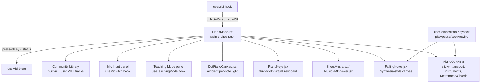
```mermaid
graph TD
    QuickBar[PianoQuickBar\nsticky: transport, instruments, Metronome/Chords]
    PianoMode[PianoMode.jsx\nMain orchestrator]

    PianoMode --> QuickBar
    PianoMode --> SheetMusic[SheetMusic.jsx / MusicXMLViewer.jsx]
    PianoMode --> Falling[FallingNotes.jsx\nSynthesia-style canvas]
    PianoMode --> PianoKeys[PianoKeys.jsx\nfluid-width virtual keyboard]
    PianoMode --> DotCanvas[DotPianoCanvas.jsx\nambient per-note light]
    PianoMode --> Teaching[Teaching Mode panel\nuseTeachingMode hook]
    PianoMode --> MicPanel[Mic Input panel\nuseMicPitch hook]
    PianoMode --> Library[Community Library\nbuilt-in + user MIDI tracks]

    Playback[useCompositionPlayback\nplay/pause/seek/rewind] --> QuickBar
    Playback --> Falling

    MidiHook[useMidi hook] -->|onNoteOn / onNoteOff| PianoMode
    PianoMode -->|pressedKeys, status| MidiStore[useMidiStore]
```

#### Instruments

Four switchable voices, all behind one `getInstrument(id).play(ctx, midi,
velocity) => { release() }` interface (`src/lib/instruments/`) — swapping
instruments never touches the rest of the piano code:

| Instrument | How it sounds |
|---|---|
| **Grand Piano** | Real sampled audio (Salamander Grand Piano, 30 notes, CC BY 3.0 — Alexander Holm), pitch-shifted to nearby notes; falls back to the additive synth below while samples are loading or if they fail to fetch |
| Electric Piano | FM synthesis (DX7-style 1:1 body + a 14:1 "bite" pair) |
| Organ | Hammond-style additive drawbars |
| Synth Pad | Detuned saws + a sub triangle, slow attack/release |

#### Teaching Mode & Mic Input

Teaching Mode (`useTeachingMode`) turns any loaded composition into a
self-paced lesson: it groups near-simultaneous notes into chord "steps"
and only advances when every note in the current step has actually been
played — no clock, no auto-advance. The keyboard highlights the next
expected note(s) in blue.

Mic Input (`useMicPitch`) runs YIN pitch detection (not naive
autocorrelation — that mis-octaves pure tones) on the microphone, so a
real woodwind or voice can drive the same Teaching Mode / visual feedback
loop a MIDI keyboard does, without playing a synthesized voice over the
real acoustic sound.

#### Community Library

Two sources, one loader: a handful of short public-domain motifs (Bach,
Beethoven, Chopin) generated in code, plus a "Your Library" section for
real user-supplied `.mid` files (`src/lib/communityMidiManifest.js` +
`public/community-midi/`, gitignored — not committed, since these are
personal transcriptions of commercial recordings, not code). Anyone can
also upload their own `.mid`, or export the current composition back out
as a real, valid standard MIDI file ("Share My Composition").

#### Keyboard-to-MIDI Mapping (keyboard fallback, no MIDI device)

```
Lower row:  Z  X  C  V  B  N  M  ,  .  /   →  C4 D4 E4 F4 G4 A4 B4 C5 D5 E5
Upper row:  Q  W  E  R  T  Y  U  I  O  P   →  C5 D5 E5 F5 G5 A5 B5 C6 D6 E6
Accidentals: S  D     G  H  J              →  C#4 D#4  F#4 G#4 A#4
             (A key = no black, like E/B gaps)
```

Base octave shifts via `settings.pianoOctave` (default: 4).

#### Metronome

- BPM range: 40–240, time signatures 2/4 through 7/4
- Visual dot indicator pulses on each beat, accent color on downbeat
- Lives inside `PianoQuickBar`'s circular popover, extracted into its own
  `Metronome.jsx` so it can run independently of the rest of the page

---

### Educator Dashboard

Lives in `src/components/educator/EducatorDashboard.jsx`, gated behind
`role === 'educator'`. Four tabs:

- **Roster** — the teacher's real join code (share it with students) plus
  a live table of every roster student's aggregate stats: total runs,
  best/avg WPM, avg accuracy, last-active. A student joins by entering the
  code under Settings → Classroom (`POST /api/teacher/roster/join`).
- **Reports** — the same roster data, searchable, with a real CSV export.
- **Accounts** — bulk-creates real student accounts (`POST
  /api/teacher/accounts/bulk`), added straight to the roster, credentials
  shown once and exportable to CSV.
- **Focus** — mode-lock/screen-lock broadcast UI; still a client-only stub
  (emits a `session:set_modes` socket event with no server handler yet).

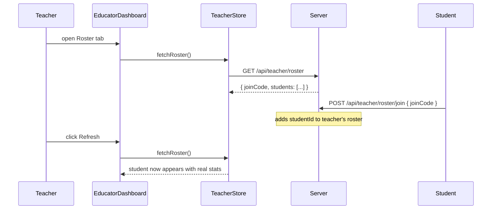
```mermaid
sequenceDiagram
    participant Teacher
    participant EducatorDashboard
    participant TeacherStore
    participant Server
    participant Student

    Teacher->>EducatorDashboard: open Roster tab
    EducatorDashboard->>TeacherStore: fetchRoster()
    TeacherStore->>Server: GET /api/teacher/roster
    Server-->>TeacherStore: { joinCode, students: [...] }

    Student->>Server: POST /api/teacher/roster/join { joinCode }
    Note over Server: adds studentId to teacher's roster

    Teacher->>EducatorDashboard: click Refresh
    EducatorDashboard->>TeacherStore: fetchRoster()
    TeacherStore-->>EducatorDashboard: student now appears with real stats
```

### Stats

Lives in `src/components/stats/StatsPage.jsx`, gated behind sign-in (there's
nothing to show a guest — runs are only ever persisted for signed-in
users). Shows summary tiles (best/avg WPM, avg accuracy), a WPM trend
chart, and paginated run history, all served by `/api/stats/*`.

### Authentication

Lives in `src/pages/AuthPages.jsx` and `src/store/index.js` (`useAuthStore`).

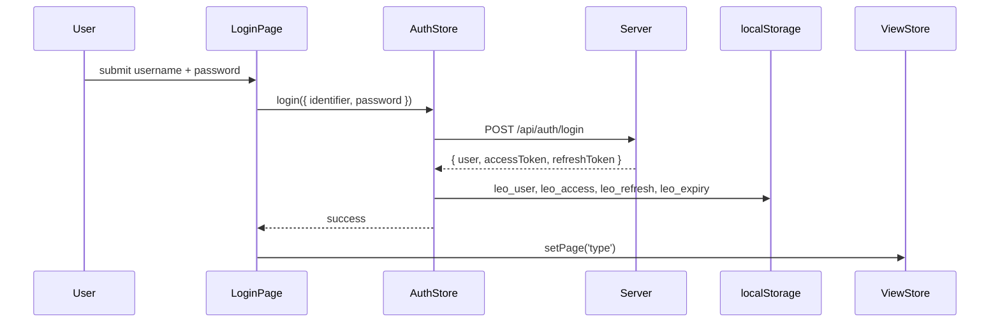
```mermaid
sequenceDiagram
    participant User
    participant LoginPage
    participant AuthStore
    participant Server
    participant localStorage

    User->>LoginPage: submit username + password
    LoginPage->>AuthStore: login({ identifier, password })
    AuthStore->>Server: POST /api/auth/login
    Server-->>AuthStore: { user, accessToken, refreshToken }
    AuthStore->>localStorage: leo_user, leo_access, leo_refresh, leo_expiry
    AuthStore-->>LoginPage: success
    LoginPage->>ViewStore: setPage('type')
```

**Roles:**
- `student` — default; no badge
- `educator` — gets "Teacher" badge in profile dropdown + access to Educator Dashboard

**Guest mode:** Full access to Type, Race, and Piano — no sign-in required.
Stats and the Educator Dashboard are gated (see [Auth Guard
Policy](#routing--page-flow) above) — the former because there's nothing
to show without a persisted history, the latter because it's tied to
teacher identity rather than progress.

**Social auth:** Google and Apple buttons are present but disabled (`Coming in a future update` tooltip).

---

### Settings & Themes

Lives in `src/components/settings/SettingsPage.jsx`.

#### Theme System

All seven themes are defined as CSS variable overrides on `[data-theme="X"]` in `index.css`.

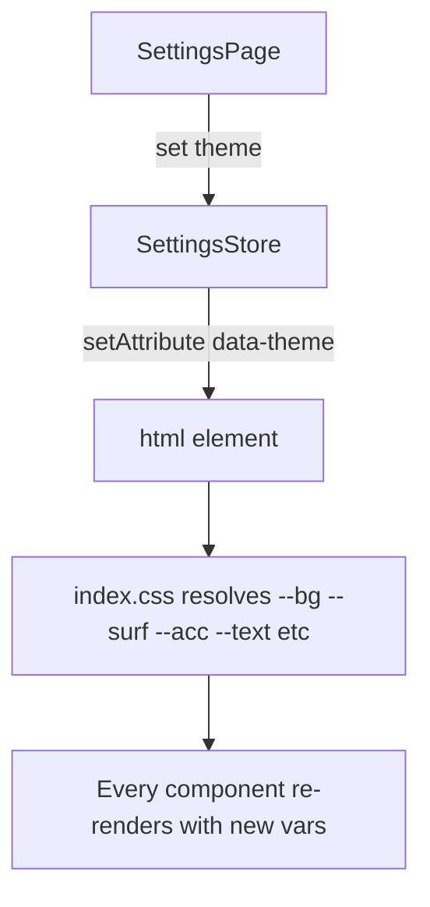
```mermaid
graph TD
    SettingsPage -->|set theme| SettingsStore
    SettingsStore -->|setAttribute data-theme| HTML[html element]
    HTML --> CSS[index.css resolves --bg --surf --acc --text etc]
    CSS --> AllComponents[Every component re-renders with new vars]
```

| Theme | --bg | --acc | Description |
|-------|------|-------|-------------|
| dark | #0e0e10 | #e8d44d | Default dark + yellow |
| light | #f8f8f5 | #3b82f6 | Clean white + blue |
| sepia | #f4efe0 | #b06a2b | Warm paper + amber |
| terminal | #0a0f0a | #00ff41 | Matrix green |
| nord | #2e3440 | #88c0d0 | Nordic cool |
| dracula | #282a36 | #bd93f9 | Purple + dark |
| rose-pine | #191724 | #ebbcba | Rosy minimal |

#### CLI Overlay (Command Palette)

Press `Escape` (when `quickRestart !== 'esc'`) to open a command palette that lets you set any setting with typed commands.

```
> theme dracula
> font fira code
> mode words 50
> lang python
```

---

## Backend & Persistence

Express + Socket.io, in `server/`. Every route talks to a `db` object
through one shared async interface — never to a file or a SQL client
directly — so the storage backend is a swap, not a rewrite:

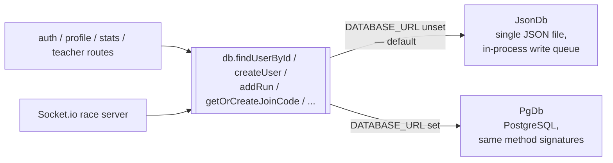
```mermaid
flowchart LR
    Routes[auth / profile / stats / teacher routes]
    Race[Socket.io race server]
    Routes --> DBInterface[["db.findUserById / createUser /\naddRun / getOrCreateJoinCode / ..."]]
    Race --> DBInterface
    DBInterface -->|DATABASE_URL unset\n— default| JsonDb[JsonDb\nsingle JSON file,\nin-process write queue]
    DBInterface -->|DATABASE_URL set| PgDb[PgDb\nPostgreSQL,\nsame method signatures]
```

- **JsonDb** (default, zero config) — one JSON file, atomic writes (write
  to a temp file, rename over the target), a write queue so concurrent
  mutations never interleave.
- **PgDb** (opt-in via `DATABASE_URL`) — structured columns for
  username/email/role/mmr/wallet, JSONB columns for the variable-shaped
  bits (`settings`, `runs`, `roster`), a real indexed `refresh_tokens`
  table for the hot token-lookup path. Schema bootstraps itself
  (`CREATE TABLE IF NOT EXISTS`) on first use — no separate migration
  tool. Enable it with `docker compose --profile postgres up -d` (adds a
  `postgres` service, off by default) and set `DATABASE_URL` in `.env`;
  existing JSON data is **not** migrated automatically — see
  `server/scripts/migrate-json-to-pg.js` for cutting a deployment over
  deliberately.

Auth: JWT access tokens (15 min) + rotating refresh tokens (30 days) with
reuse detection — a replayed refresh token revokes its whole session
family. Passwords are bcrypt-hashed; login timing is constant regardless of
whether the identifier exists, so response latency can't be used to
enumerate registered usernames. Rate limiting on `/api/auth/*` and
`/api/teacher/accounts/bulk` (bcrypt is deliberately slow), plus a global
per-IP limit across the whole API.

---

## Data Flows

### End-to-End Typing Session

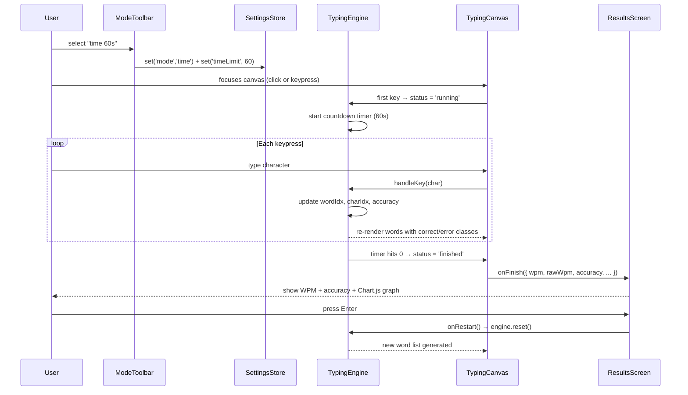
```mermaid
sequenceDiagram
    participant User
    participant ModeToolbar
    participant SettingsStore
    participant TypingEngine
    participant TypingCanvas
    participant ResultsScreen

    User->>ModeToolbar: select "time 60s"
    ModeToolbar->>SettingsStore: set('mode','time') + set('timeLimit', 60)

    User->>TypingCanvas: focuses canvas (click or keypress)
    TypingCanvas->>TypingEngine: first key → status = 'running'
    TypingEngine->>TypingEngine: start countdown timer (60s)

    loop Each keypress
        User->>TypingCanvas: type character
        TypingCanvas->>TypingEngine: handleKey(char)
        TypingEngine->>TypingEngine: update wordIdx, charIdx, accuracy
        TypingEngine-->>TypingCanvas: re-render words with correct/error classes
    end

    TypingEngine->>TypingCanvas: timer hits 0 → status = 'finished'
    TypingCanvas->>ResultsScreen: onFinish({ wpm, rawWpm, accuracy, ... })
    ResultsScreen-->>User: show WPM + accuracy + Chart.js graph

    User->>ResultsScreen: press Enter
    ResultsScreen->>TypingEngine: onRestart() → engine.reset()
    TypingEngine-->>TypingCanvas: new word list generated
```

### Piano Session with MIDI Hardware

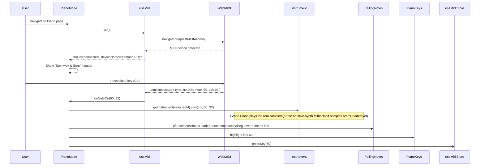
```mermaid
sequenceDiagram
    participant User
    participant PianoMode
    participant useMidi
    participant WebMIDI
    participant Instrument
    participant FallingNotes

    User->>PianoMode: navigate to Piano page
    PianoMode->>useMidi: init()
    useMidi->>WebMIDI: navigator.requestMIDIAccess()
    WebMIDI-->>useMidi: MIDI device detected
    useMidi-->>PianoMode: status='connected', deviceName='Yamaha P-45'
    PianoMode->>PianoMode: Show "Steinway & Sons" header

    User->>WebMIDI: press piano key (C4)
    WebMIDI-->>useMidi: onmidimessage { type: noteOn, note: 60, vel: 92 }
    useMidi->>PianoMode: onNoteOn(60, 92)
    PianoMode->>Instrument: getInstrument(selectedId).play(ctx, 60, 92)
    Note over Instrument: Grand Piano plays the real sample\n(or the additive-synth fallback\nif samples aren't loaded yet)
    PianoMode->>FallingNotes: (if a composition is loaded) note continues falling toward the hit line
    PianoMode->>PianoKeys: highlight key 60
    PianoMode->>useMidiStore: pressKey(60)
```

---

## Component Hierarchy


```mermaid
graph TD
    App --> TopNav
    App --> Main[main page-root]
    App --> Footer
    App --> ToastContainer
    App --> CLIOverlay

    TopNav --> Logo
    TopNav --> NavLinks[Type / Race / Piano / Settings]
    TopNav --> MidiIndicator
    TopNav --> ProfileMenu[Avatar + Dropdown]

    Main --> TypingHub
    Main --> RacePage2[RacePage]
    Main --> PianoMode2[PianoMode]
    Main --> StatsPage2[StatsPage]
    Main --> SettingsPage2[SettingsPage]
    Main --> AuthPages2[LoginPage / RegisterPage]
    Main --> EducatorDash[EducatorDashboard]

    TypingHub --> ModeToolbar2[ModeToolbar]
    TypingHub --> TypingCanvas2[TypingCanvas]
    TypingHub --> ResultsScreen2[ResultsScreen]

    TypingCanvas2 --> WordSpans[Word spans: correct/current/extra classes]
    TypingCanvas2 --> Caret[Caret span with animation]
    ResultsScreen2 --> WpmChart[Chart.js line graph]
    StatsPage2 --> TrendChart[Chart.js WPM trend]

    RacePage2 --> PlayerTracks[PlayerTrack × 4]
    RacePage2 --> VoteOptions[VoteOption × 3]
    RacePage2 --> RaceCanvas[TypingCanvas in race mode]

    PianoMode2 --> QuickBar2[PianoQuickBar\ntransport/instruments/Metronome/Chords]
    PianoMode2 --> Falling2[FallingNotes canvas]
    PianoMode2 --> SheetMusic2[SheetMusic SVG staff]
    PianoMode2 --> PianoKeys2[PianoKeys fluid-width virtual keyboard]
    PianoMode2 --> DotCanvas2[DotPianoCanvas ambient light]
    PianoMode2 --> MusicXMLViewer2[MusicXMLViewer]

    EducatorDash --> RosterTab[Roster / Reports / Accounts / Focus tabs]
```

---

## Design System

All design tokens are CSS variables in `src/index.css`.

### Color Variables

```css
/* Dark theme defaults */
--bg:       #0e0e10    /* Page background */
--surf:     #16161a    /* Card / panel */
--surf2:    #1e1e24    /* Secondary surface */
--surf3:    #26262e    /* Elevated surface */
--border:   rgba(255,255,255,0.07)
--border2:  rgba(255,255,255,0.13)
--acc:      #e8d44d    /* Accent — typed text, buttons */
--text:     rgba(255,255,255,0.88)
--sub:      rgba(255,255,255,0.38)
--hint:     rgba(255,255,255,0.20)
--err:      #f87171    /* Error / mistyped */
--ok:       #4ade80    /* Correct / success */
--blue:     #5b8af5
--purple:   #a78bfa
```

### Typography

```css
--font-mono:     'Space Mono'        /* Typing canvas text */
--font-sans:     'DM Sans'           /* UI labels, nav */
--typing-size:   clamp(1rem, 1.4vw + 0.5rem, 1.25rem)   /* fluid */
```

### Spacing & Radius

```css
--r-sm:  4px
--r-md:  8px
--r-lg:  10px
--r-xl:  12px
```

### Transitions

```css
--tx-fast:   80ms
--tx-base:   160ms
--tx-slow:   280ms
--tx-spring: 220ms cubic-bezier(0.34, 1.56, 0.64, 1)
```

### TopNav Hover Animation

Nav icons rise `translateY(-5px)` and their text labels fade in from below. The settings gear rotates 360° + rises on hover (420ms ease transition).

---

## External Integrations

### Web MIDI API

```mermaid
flowchart LR
    Browser -->|navigator.requestMIDIAccess| MIDIAccess
    MIDIAccess --> Inputs[MIDIInput devices]
    Inputs -->|onmidimessage| useMidi
    useMidi -->|noteOn/noteOff| PianoMode
```

Browser support: Chrome/Edge (full), Firefox (requires flag), Safari (not supported → keyboard fallback).

### Web Audio API

```mermaid
flowchart LR
    PianoMode --> AudioCtx[getAudioCtx\nlazy-created, shared singleton]
    AudioCtx --> Registry[getInstrument id\nsrc/lib/instruments/]
    Registry -->|Grand Piano| Sample[AudioBufferSourceNode\nreal sample, pitch-shifted]
    Registry -->|Electric Piano| FM[Two-oscillator FM pair]
    Registry -->|Organ| Drawbars[Additive drawbar oscillators]
    Registry -->|Synth Pad| Pad[Detuned saws + sub triangle]
    Sample --> Destination[AudioContext.destination\n→ system audio]
    FM --> Destination
    Drawbars --> Destination
    Pad --> Destination
```

### Socket.io (Race Server)

Real server-side matchmaking lives in `server/race/socket.js` — in-memory
lobby state, the exact event contract the client already speaks, flat MMR
deltas + coin payouts on placement, and a WPM sanity cap that flags
implausible finishes instead of trusting the client. Server expected at
`http://localhost:3001` (or `VITE_API_URL` — see Environment below). The
app degrades gracefully to local bot-race mode if no players queue within
8 seconds or the server is unreachable — guests race exactly like
signed-in players either way; only MMR/wallet persistence is skipped for
guests.

Events emitted by client:
- `race:queue` — join matchmaking
- `race:vote` — submit text option vote
- `race:progress` — keystroke progress update

Events received from server:
- `race:matched`, `race:vote_start`, `race:countdown_start`, `race:payload`, `race:start`, `race:opponent_update`, `race:anticheat_warning`, `race:over`

### Chart.js (Results)

WPM burst chart rendered in `ResultsScreen.jsx`:
- Line chart: WPM per word burst (X = word index, Y = WPM)
- Scatter overlay: Error keystrokes mapped by time ratio
- Colors sourced from CSS vars (`--acc`, `--err`) for theme compatibility

### @spotify/basic-pitch (Audio-to-MIDI)

Converts uploaded MP3/WAV to MIDI notes. Loaded via dynamic import with `/* @vite-ignore */` to avoid build errors if the package is not installed.

```bash
npm install @spotify/basic-pitch    # required to enable this feature
```

---

## Testing & CI

Vitest covers both sides from one `npm test` (it picks up frontend
`.test.jsx`/`.test.js` files under `src/` and server `*.test.js` files
under `server/`, since they run in different environments — jsdom vs
node — declared per-file via `// @vitest-environment`):

- **Frontend** — React Testing Library for hooks/components (`useMidi`,
  `useTypingEngine`, the settings store).
- **Server** — Supertest driving the real Express app end-to-end: auth
  (register/login/refresh/reuse-detection), stats persistence, the
  teacher roster + bulk-accounts endpoints, and a Postgres-specific suite
  (`server/pgDb.test.js`) that only runs when `DATABASE_URL` points at a
  real instance — skipped cleanly otherwise, so `npm test` never needs
  Postgres installed.
- **Race server** — an integration test drives two real
  `socket.io-client` connections through the full lobby lifecycle.

[`.github/workflows/ci.yml`](.github/workflows/ci.yml) runs lint, build,
and test on every push to `main` and every pull request.

---

## Getting Started

### Prerequisites

- Node.js 18+
- npm 9+

### Install & Run

```bash
# Install dependencies
npm install

# Start dev server
npm run dev
# → http://localhost:5173

# Build for production
npm run build

# Preview production build
npm run preview
```

### Backend (auth + profile API)

The app works fully offline (guest typing + bot races) without this. To get
real accounts instead of guest-only mode:

```bash
# One-time: copy the env template and set JWT_SECRET
cp .env.example .env
node -e "console.log(require('crypto').randomBytes(48).toString('hex'))"  # paste into .env

npm run server        # or: npm run server:dev  (auto-restart on change)
# → http://localhost:3001
```

Implementation lives in [`server/`](server/) — Express, JWT access tokens
with rotating refresh tokens (reuse detection revokes the whole session on
replay), bcrypt password hashing, Zod-validated input, and rate limiting on
`/api/auth/*`. Storage is a JSON file at `server/data/db.json` (gitignored —
it holds password hashes) by default, with PostgreSQL available as a
drop-in opt-in — see [Backend & Persistence](#backend--persistence). Race
matchmaking (Socket.io) is real too — starting this server enables actual
multiplayer races instead of local bots. Run the test suite with
`npm test`.

### Docker

The whole stack (frontend behind nginx + the backend) runs via
docker-compose — this is how it's actually deployed in practice, not just
local `npm run dev`:

```bash
cp .env.example .env
# fill in JWT_SECRET (required) and CORS_ORIGIN if not the default

docker compose build
docker compose up -d
# → frontend http://localhost, backend http://localhost:3001
```

Add `--profile postgres` to also start the optional Postgres service (see
[Backend & Persistence](#backend--persistence)) — it's off by default so a
plain `docker compose up` never changes behavior for anyone not opting in.

### Optional: Audio-to-MIDI

```bash
npm install @spotify/basic-pitch
```

### Environment

Copy `.env.example` to `.env` before running the backend — `JWT_SECRET`
is required (the server refuses to boot without one in production, and
warns loudly in dev). The frontend's API base URL defaults to
`http://localhost:3001` but is env-driven via `VITE_API_URL` — since the
frontend is a static bundle with no server-side runtime, this has to be
baked in at *build* time (a Docker build `ARG`, wired through
`docker-compose.yml`), not read at container startup. Only needs setting if
the API and frontend end up on different hosts instead of one
docker-compose stack.

---

## Anti-Cheat (Race Mode)

Race payloads are intentionally withheld until the countdown completes. The server only sends `race:payload` after `race:countdown_start`, ensuring no client can pre-read the text. Additional measures:

1. Keystroke timestamp verification on server
2. Real-time opponent progress via server relay (no peer-to-peer)
3. `anticheatWarnings` counter visible in race store for monitoring
